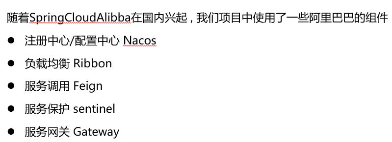

# 自我介绍（待修改）

面试官，您好，我叫张涵姣，就读于厦门大学软件工程专业。很荣幸能够有机会，参加本次面试。我成绩优异，在大一的时候成功通过转专业的考核进入了软件工程专业。在社会生活中我担任生活兼权益委员，组织过多个活动。在学校的课程中，我学习了数据结构与算法、计算机网络、操作系统等课程，对计算机基础有一定的认识。我在大学期间参与过一个采用Spring框架、面向对象的方法设计和实现一个高并发、高可用的电子商城后端系统。我希望能够有机会进入到贵公司深入学习，谢谢！

# 项目介绍

* 项目整体目标：采用Spring框架，面向对象的设计方法实现一个高并发、高可用的电子商城后端系统。实现顾客可以在线购买商品，商铺可以在线销售商品，平台可以监管整个过程。
* 我们小组负责的模块：我们主要设计了订单的模块，其中我参与比较多的是顾客支付订单这个api。
* 我们小组从设计对象模型和ER图开始，经历了编写需求规格说明书、使用apifox设计api，在编写了代码之后进行了黑盒测试来保证了代码的可用性，我们也使用了Jmeter进行了性能的测试。
* 在这个项目之中，我们主要使用了MySQL作为数据库，主要使用了Redis的中间件。

# 顾客支付订单api逻辑（你这个api做了什么呢？）

* 传入参数：订单id，支付积点，支付渠道，顾客对象
* 主要目标：将支付订单api所需要的参数传给支付订单这个api，这些参数主要包括：商品支付渠道id，支付单号，用户实际付款金额，商家分账金额和用户user对象
* 过程
  * 在拿到了订单的id之后，到数据库中查询该订单所包含商品
  * 拿到了商品之后，计算使用了积点支付之后，顾客实际支付金额与平台分账金额（创建订单的时候已经使用了优惠券）
  * 这里需要重新计算分账金额的原因是，使用了积点支付之后，我们假定每个商品的分账比例不同，我们需要保持分账比例不变，重新计算出使用了积点支付之后每个商品的分账金额。
  * 在计算好了实际支付金额之后，我们将生成的支付单号，用户实际支付金额，商家分账金额等这些信息传给支付这个api
  * 在获得了回调的消息提示订单支付成功了之后，我们会调用商品模块的修改库存量的接口修改该订单中每个商品的库存量，并且根据订单的状态机来修改订单的状态，例如。。。
* 亮点：布隆过滤器，实现基于session的用户登录拦截、支付订单等服务

# 微服务架构（简历上的内容）

本部分参考邱明老师JavaEE的ppt：12.微服务体系架构

## 什么是微服务架构？微服务架构的特点？

* 微服务是考虑围绕着业务领域组件来创建应用，这些应用可独立地进行开发、管理和加速。
  * 单一职责：每一个微服务应该都是单一职责的，一个微服务解决一个业务问题。应用系统是一组微服务地集合。
  * 松散耦合：服务与服务之间应该采用轻量级地通信（HTTP、REST和JSON）相互连接。
  * 独立存在：每一个微服务拥有独立的数据结构和数据库，数据只有自己可以处理。每一个服务可以独立编译打包部署。
* 微服务的四项基本原则
  * 独立部署
  * 集中配置
  * 客户透明
  * 服务容错




# 项目部署的相关命令

* 下载redis、mysql等：docker pull redis
* 查看服务运行在哪台机器：docker service ps redis
* 运行mysql的命令：docker exec -it [CONTAINER ID] mysql -uroot p

* 在 docker swarm 中创建服务：docker service create --name redis --constraint node.labels.server==redis --mount type=bind,source=/root/OOMALL/conf/redis,destination=/etc/redis,readonly --network my-net -e CONFFILE=/etc/redis/redis.conf -d redis/redis-stack-server:latest
* 打包项目mvn clean install
* mvn clean pre_integration-test -Dmaven.test.skip=true
* 在管理机上创建服务：docker node update --label-add server-goods node2
* docker service create --name goods --network my-net --constraint node.labels.server==goods --publish published=8080,target=8080 --mount type=bind,source=/root/logs,destination=/app/logs -d xmu-oomall/goods:0.0.1-SNAPSHOT
* 启动nacos：docker service create --name nacos --constraint node.labels.server==nacos --network my-net --publish published=8848,target=8848 -e MODE=standalone -e PREFER_HOST_MODE=hostname -d nacos/nacos-server:v2.1.2
  * 其中MODE表示用standalone模式启动， PREFER_HOST_MODE表示支持hostname方式，因为用的是swarn，需要用服务名查询
    设置集中配置的application.yaml
    在浏览器中访问http://[IP]:8848/nacos, IP为集群中任意一台服务器ip
    输入默认用户名/密码: nacos/nacos
    即可进入nacos的控制台
    在ConfigurationManagement->Configurations中增加一项配置Create Configuration
    Data Id的格式为 ${spring.application.name}.yaml, 如商品模块为goods-service.yaml，商铺模块为shop-service.yaml，支付模块为payment-service.yaml
    Group：为默认的DEFAULT_GROUP
    Format：选Yaml
    Configuration Content：将对应模块的application.yaml内容拷贝进来，注意不能有中文注释
    按publish即可
* docker run --name nacos -p 8848:8848 -e MODE=standalone -e PREFER_HOST_MODE=hostname -d nacos/nacos-server:v2.1.2

# 八股问题

## bean的生命周期


## SpringMVC的执行流程

①用户发送出请求到前端控制器DispatcherServlet

②DispatcherServlet收到请求调用HandlerMapping（处理器映射器）

③HandlerMapping找到具体的处理器，生成处理器对象及处理器拦截器(如果有)，再一起返回给DispatcherServlet。

④DispatcherServlet调用HandlerAdapter（处理器适配器）

⑤HandlerAdapter经过适配调用具体的处理器（Handler/Controller）

⑥方法上添加了@ResponseBody

⑦通过HttpMessageConverter来返回结果转换为JSON并响应

## Springboot自动配置原理

1, 在Spring Boot项目中的引导类上有一个注解@SpringBootApplication，这个注解是对三个注解进行了封装，分别是：

* l@SpringBootConfiguration

* l@EnableAutoConfiguration

* l@ComponentScan

2, 其中@EnableAutoConfiguration是实现自动化配置的核心注解。 该注解通过@Import注解导入对应的配置选择器。

内部就是读取了该项目和该项目引用的Jar包的的classpath路径下META-INF/spring.factories文件中的所配置的类的全类名。 在这些配置类中所定义的Bean会根据条件注解所指定的条件来决定是否需要将其导入到Spring容器中。

3, 条件判断会有像@ConditionalOnClass这样的注解，判断是否有对应的class文件，如果有则加载该类，把这个配置类的所有的Bean放入spring容器中使用。

## 常见注解

### Spring的常见注解

| **注解**                                       | **说明**                                                     |
| ---------------------------------------------- | ------------------------------------------------------------ |
| @Component、@Controller、@Service、@Repository | 使用在类上用于实例化Bean                                     |
| @Autowired                                     | 使用在字段上用于根据类型依赖注入                             |
| @Qualifier                                     | 结合@Autowired一起使用用于根据名称进行依赖注入               |
| @Scope                                         | 标注Bean的作用范围                                           |
| @Configuration                                 | 指定当前类是一个 Spring  配置类，当创建容器时会从该类上加载注解 |
| @ComponentScan                                 | 用于指定 Spring  在初始化容器时要扫描的包                    |
| @Bean                                          | 使用在方法上，标注将该方法的返回值存储到Spring容器中         |
| @Import                                        | 使用@Import导入的类会被Spring加载到IOC容器中                 |
| @Aspect、@Before、@After、@Around、@Pointcut   | 用于切面编程（AOP）                                          |

### SpringMVC常见注解

| **注解**        | **说明**                                                     |
| --------------- | ------------------------------------------------------------ |
| @RequestMapping | 用于映射请求路径，可以定义在类上和方法上。用于类上，则表示类中的所有的方法都是以该地址作为父路径 |
| @RequestBody    | 注解实现接收http请求的json数据，将json转换为java对象         |
| @RequestParam   | 指定请求参数的名称                                           |
| @PathViriable   | 从请求路径下中获取请求参数(/user/{id})，传递给方法的形式参数 |
| @ResponseBody   | 注解实现将controller方法返回对象转化为json对象响应给客户端   |
| @RequestHeader  | 获取指定的请求头数据                                         |
| @RestController | @Controller  + @ResponseBody                                 |

### Springboot常见注解

| **注解**                 | **说明**                                        |
| ------------------------ | ----------------------------------------------- |
| @SpringBootConfiguration | 组合了-  @Configuration注解，实现配置文件的功能 |
| @EnableAutoConfiguration | 打开自动配置的功能，也可以关闭某个自动配置的选  |
| @ComponentScan           | Spring组件扫描                                  |

# 电商系统架构的九个常见问题

https://juejin.cn/post/7075570273528840229

## 避免重复下载：

* 解决方案：采用幂等机制，多次请求和一次请求产生的效果是一样的。
* 方案一：利用数据库自身特性“主键唯一约束”，在插入订单记录时，带上主键值，如果订单重复，记录插入会失败。
* 方案二：前端通过js脚本控制
* **方案三**：
  * 前后约定附加参数校验。
  * 当用户点击购买按钮时，渲染下单页面，展示商品、收货地址、运费、价格等信息，同时页面会埋上Token信息，用户提交订单时，后端业务逻辑会校验token，有且匹配才认为是合理请求。

## 订单快照，减少存储成本

* 热销商品的快照，同步保存一份商品详情信息。

## 购物车，混合存储

* 加入购物车的时候不强迫用户登录，未登录的时候创建一个了事Token作为用户唯一标识，创建临时购物车表。

## 库存超卖

* 方案一：通常在扣减库存的场景下使用行级锁，通僧偶山帅顺便请本身对记录加锁的控制，保证数据库的更新的安全性，并且通过where语句的条件保证库存不会被减到0以下
* 方案二：设置数据库的字段数据为无符号整数，这样减后库存字段值小于零时SQL语句会报错

## 商家发货，物流单更新ABA问题

* 解决方案：数据库表引入一个额外字段version，每次更新世，判断表中的版本号与请求参数携带的版本号是否一致。

## 账户余额更新，保证事务

* 账户流水核心字段：流水ID、金额、交易双方账户、交易时间戳、订单号

注意：账户流水只能新增，不能修改和删除

* 多个微服务调用，用到分布式事务

## MySQL读写分离带来的数据不一致问题

* 互联网业务大部分都是读多写少，为了提升数据库集群的吞吐性能，我们通常会采用主从架构、读写分离
* **添加无关紧要的中间页**

## 历史订单，归档

* 冷热数据区分的标准是什么？
  * 方案一：以“下单时间”为标准，将3个月前的订单数据当作冷数据，3个月内的当作热数据
  * 方案二：根据“订单状态”字段来区分，已完结的订单当作冷数据，未完结的订单当作热数据
  * 方案三：组合方式，下单时间>3个月且已完结的作为冷数据，其他的作为热数据
* 如何出发冷热数据的分离？
  * 方案一：直接修改业务代码，每次业务请求出发冷热数据判断，根据结构路由到对应的冷数据表或热数据表。缺点：如果判断标准时时间维度，数据国企了无法主动感知。
  * 方案二：改变binlog
  * 方案三：跑定时任务
* 如何实现冷热数据分离？
  * 判断数据是冷、还是热
  * 将冷数据插入冷数据表中
  * 然后，从原来的热裤中删除迁移的数据
* 如何使用热数据？
  * 方案一：界面设计时会有选项区分
  * 方案二：直接在业务代码里区分

## 订单分库分表，多维度查询

1、买家，查询 `我的订单` 列表，需要根据 `buyer_id` 来查询

2、查看订单详情，需要根据 `order_id` 来查询

3、卖家，查询 `我的销售` 列表，需要根据 `seller_id` 来查询

一个订单号 19 位，我们会发现同一个用户不同订单的最后 6 位都是一样的，没错，那是用户id的后6位。

这样，上文中  `场景1`、`场景2` 的查询可以共性抽取， 采用 `buyer_id` 或 `order_id`  的 `后六位` 作为分表键，对 `1 000 000` 取模，得到买家维度的订单分表的编号。

至于 `场景3` 卖家维度的订单查询，我们可以采用数据异构方式，按 `seller_id` 维度另外存储一份数据，专门供卖家使用。

# 高并发中，redis利用Lua减库存，解决超买问题

https://juejin.cn/post/6859165561650151437

```java
// 定义 Redis 键列表，包括商品数量的键和订单的键
List<String> keys = Arrays.asList("goodsKey:85265602", "OrderKey:457811515"); 

// 定义参数数组，这里只有一个参数，可能是订单信息或者扣减数量，具体根据 Lua 脚本而定
String[] arg = {"1232555"};

// 创建 RedisScript 对象，指定返回结果的类型为 Long 类型
DefaultRedisScript<Long> stringDefaultRedisScript = new DefaultRedisScript<>(); 

// 设置 Lua 脚本文本到 RedisScript 对象中
stringDefaultRedisScript.setScriptText(STOCK_LUA);

// 执行 Lua 脚本，并传递 Redis 键列表和参数数组作为参数，结果存储在 res 变量中
Long res = redisTemplate.execute(stringDefaultRedisScript, keys, arg);

```

